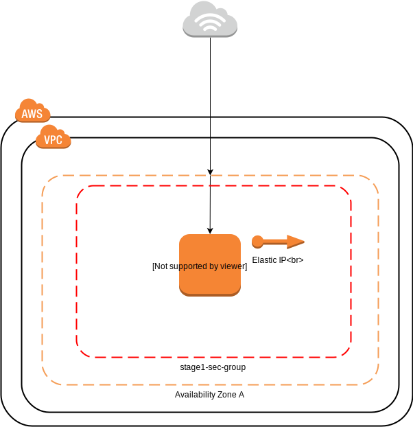

# Basic Terraform Example

A simple template to load a docker image into an aws ec2 instance.

# How To Use
```bash
# View Plan
terraform plan

# Apply Plan
terraform apply

# Destroy
terraform destroy
```

# Deployment Diagram

